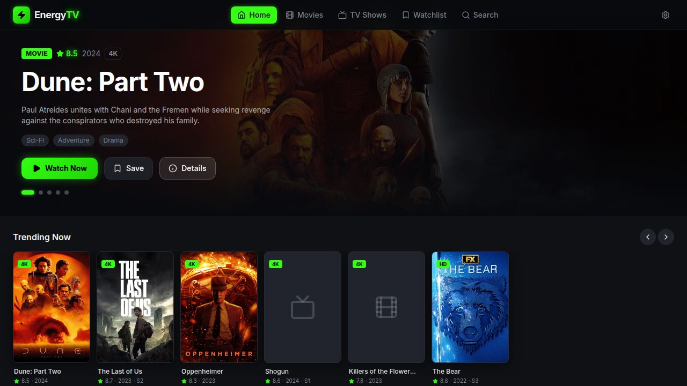

<div align="center">


# EnergyTV

**Stream movies & TV shows for free**

A homemade streaming service sourced from P2P websites — every movie, including those still in theaters. Features roll out almost daily.

[](https://github.com/Xion97522/EnergyTV-2Beta/releases/latest)
[](https://github.com/Xion97522/EnergyTV-2Beta/releases/latest)
[](LICENSE)



</div>

---

## Download

| Platform | Format | Link |
|---|---|---|
| 🐧 Linux | `.deb` · `AppImage` | [Latest release →](https://github.com/Xion97522/EnergyTV-2Beta/releases/latest) |
| 🍎 macOS | `.dmg` · `.zip` | [Latest release →](https://github.com/Xion97522/EnergyTV-2Beta/releases/latest) |
| 🪟 Windows | `.exe` installer · portable | [Latest release →](https://github.com/Xion97522/EnergyTV-2Beta/releases/latest) |
| 🤖 Android | `APK` (sideload) | [Latest release →](https://github.com/Xion97522/EnergyTV-2Beta/releases/latest) |
| 🌐 Web | PWA (no install) | [Open in browser →](https://xion97522.github.io/EnergyTV-2Beta/) |

> **Android install:** Enable *Install unknown apps* in settings, then open the APK. Requires Android 7.0+.

---

## Features

- 🎬 **Full catalog** — Powered by TMDB. Every movie and show, including new theater releases
- 🔍 **Search** — Find anything instantly across the entire library
- ▶️ **Continue watching** — Picks up exactly where you left off, synced across devices
- ☁️ **Cloud sync** — Watch history backed up via Supabase, available on all your devices
- 🛡️ **Ad blocker** — Built-in fetch/XHR interceptor keeps the player clean
- 🔐 **Auth** — Sign in with Supabase to unlock cloud sync and personal history
- 📱 **PWA** — Install directly from the browser on any device, works offline
- 🖥️ **Desktop apps** — Native Electron builds for Windows, macOS, and Linux
- 📲 **Android APK** — Capacitor-wrapped native app for Android

---

## Tech Stack

| Layer | Technology |
|---|---|
| Frontend | React 19 · TypeScript · Vite · Tailwind CSS |
| Auth & sync | Supabase |
| Catalog | TMDB API |
| PWA | Vite Plugin PWA · Workbox |
| Desktop | Electron · electron-builder |
| Android | Capacitor |
| Deploy | GitHub Pages · GitHub Actions |

---

## Dev Setup

**Requirements:** Node 20+, pnpm 9+

```bash
# Clone
git clone https://github.com/Xion97522/EnergyTV-2Beta.git
cd EnergyTV-2Beta

# Install
pnpm install

# Set env vars
cp artifacts/energy-tv/.env.example artifacts/energy-tv/.env
# Fill in VITE_TMDB_API_KEY, VITE_SUPABASE_URL, VITE_SUPABASE_ANON_KEY

# Run dev server
cd artifacts/energy-tv
pnpm dev
```

App runs at `http://localhost:5000`.

### Build

```bash
# Web
cd artifacts/energy-tv
pnpm build

# Desktop (requires Electron deps — see electron/ folder)
npx electron-builder --linux    # or --mac / --win

# Android (requires Android SDK)
cd capacitor-app
npx cap sync android
cd android && ./gradlew assembleDebug
```

### CI / Releases

Pushing a `v*` tag triggers the GitHub Actions workflow which builds all platforms automatically and attaches the artifacts to a GitHub Release.

```bash
git tag v1.0.0
git push origin v1.0.0
```

---

## Secrets (GitHub Actions)

Add these in **Settings → Secrets → Actions**:

| Secret | Description |
|---|---|
| `VITE_TMDB_API_KEY` | TMDB API key |
| `VITE_SUPABASE_URL` | Supabase project URL |
| `VITE_SUPABASE_ANON_KEY` | Supabase anon key |

---

## Built by

**CrAzE / NELABEL** — [@crazemusicofficial](https://youtube.com/@crazemusicofficial)
